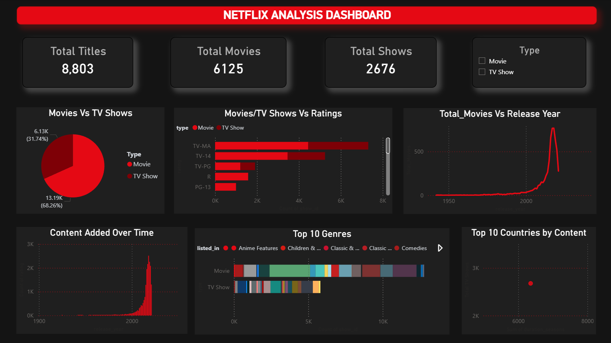

# Netflix Analysis Dashboard

## Project Highlights
```
✔ Interactive Power BI Dashboard
✔ Content Trend Analysis
✔ Genre and Country Analysis
✔ KPI Tracking
✔ Business Recommendations
```

## Overview
This project presents an interactive Power BI dashboard for analyzing Netflix's content library. The dashboard provides insights into movies and TV shows based on genres, ratings, countries, release years, and content distribution.

## Problem Statement
Netflix hosts thousands of movies and TV shows worldwide. Understanding content trends can help identify popular genres, content growth, and regional distribution.

## Objectives
* Analyze the distribution of Movies and TV Shows.
* Identify top genres and countries producing content.
* Study content growth over time.
* Analyze content ratings and durations.

## Dataset Information
* Dataset: Netflix Titles Dataset
* Source: Kaggle
* Records: 6000+ titles

## Tools Used
* Power BI
* Power Query
* DAX
* Excel

## Dashboard Features
* Interactive filters and slicers
* Genre analysis
* Country-wise analysis
* Rating analysis
* Release year trends
* Movies vs TV Shows comparison

## Key Performance Indicators (KPIs)
* Total Titles
* Total Movies
* Total TV Shows
* Top Genre
* Top Producing Country

## Dashboard Screenshot


## Key Business Insights
1. Movies constitute the majority of Netflix's content library.
2. The United States contributes the highest number of titles.
3. Drama and International Movies are among the most popular genres.
4. Content production increased significantly after 2015.
5. TV Shows are growing faster than Movies in recent years.

## Business Recommendations
* Invest more in high-performing genres.
* Expand production in emerging markets.
* Increase regional content offerings.
* Focus on producing high-demand TV series.

## Repository Structure
```
Netflix-Analysis-Dashboard/
├── Netflix_Dashboard.pbix
├── dataset/
│   └── netflix_data.csv
├── screenshots/
│   ├── Netflix.png
├── README.md
```

## How to Use
Download the .pbix file and open it using Power BI Desktop.
